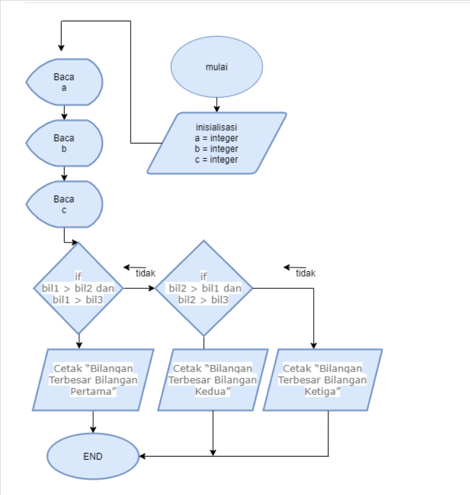
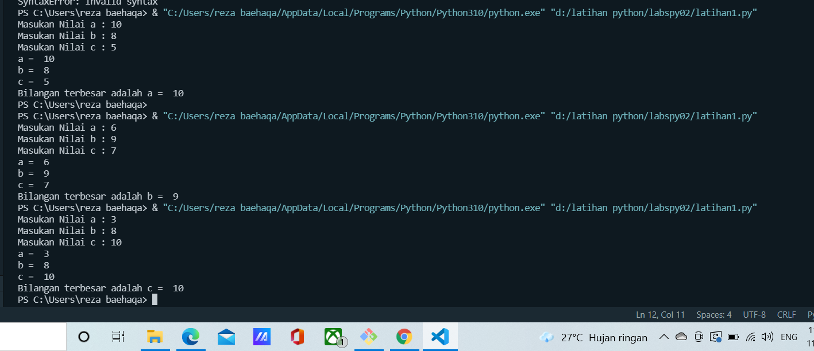

## Membuat program sederhana dengan input tiga buah bilangan dan menampilkan bilangan terbesar

### algoritman dari programnya
1. mulai
2. inisiasi bil1,bil2,bil3, sebagai integer
3. Baca bilangan 1.
4. Baca bilangan 2.
5. Baca bilangan 3.
6. jika bil1 > bil2 dan bil1 > bil maka
7. kerjakan langkah 8, selain itu 
8. Jika bil2 > bil1 dan bil2 > bil3 maka
9. kerjakan langkah 9, selain itu kerjakan langkah 10.
10. Cetak “Bilangan Terbesar Bilangan Pertama”.
11. Cetak “Bilangan Terbesar Bilangan Kedua”.
12. Cetak “Bilangan Terbesar Bilangan Ketiga”.
13. Selesai

### flowchart
ini adalah flowchart dari programnya

### output program
ini adalah tampilan dari output program dengan input tiga buah bilangan

